# generativedesign 
#### techniques and portions of code from http://www.generative-gestaltung.de/
#### See all output here: [output dir](src/main/resources/output)
 
## Samples

#### Agents
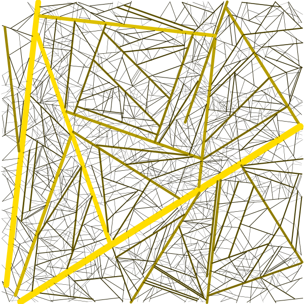

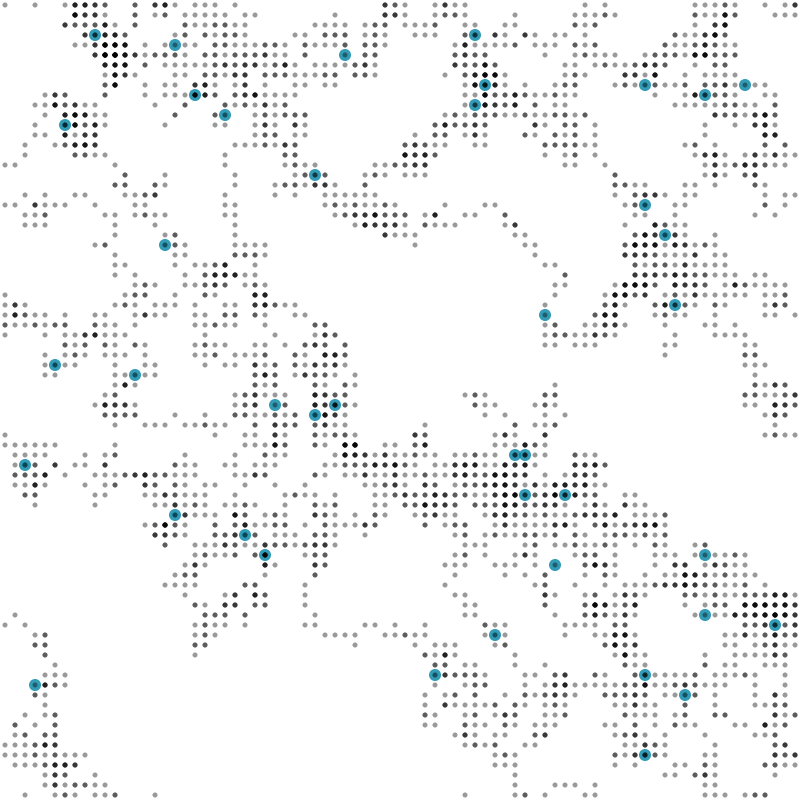

#### Grid Movement
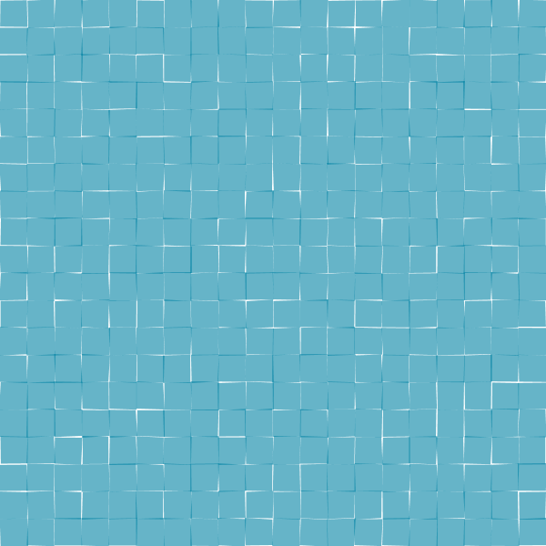

#### Form Morph
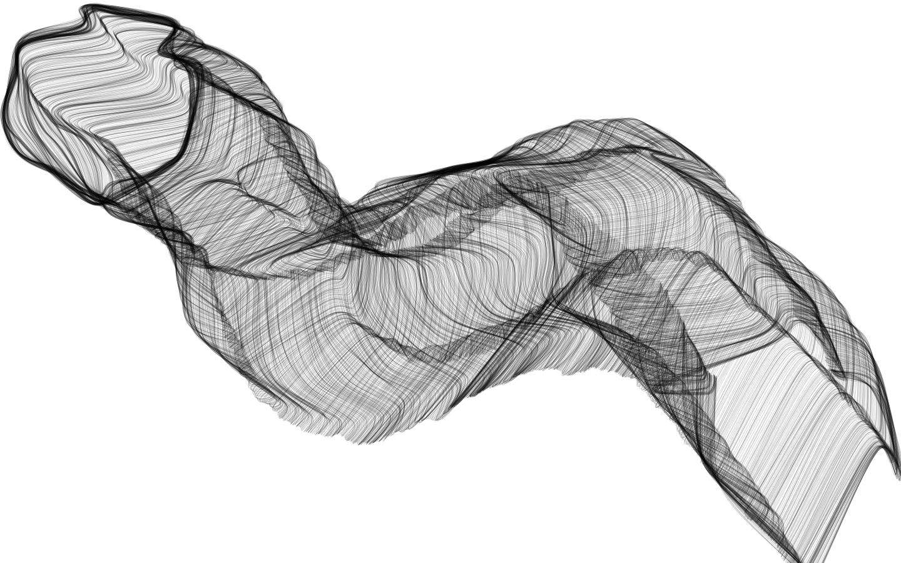

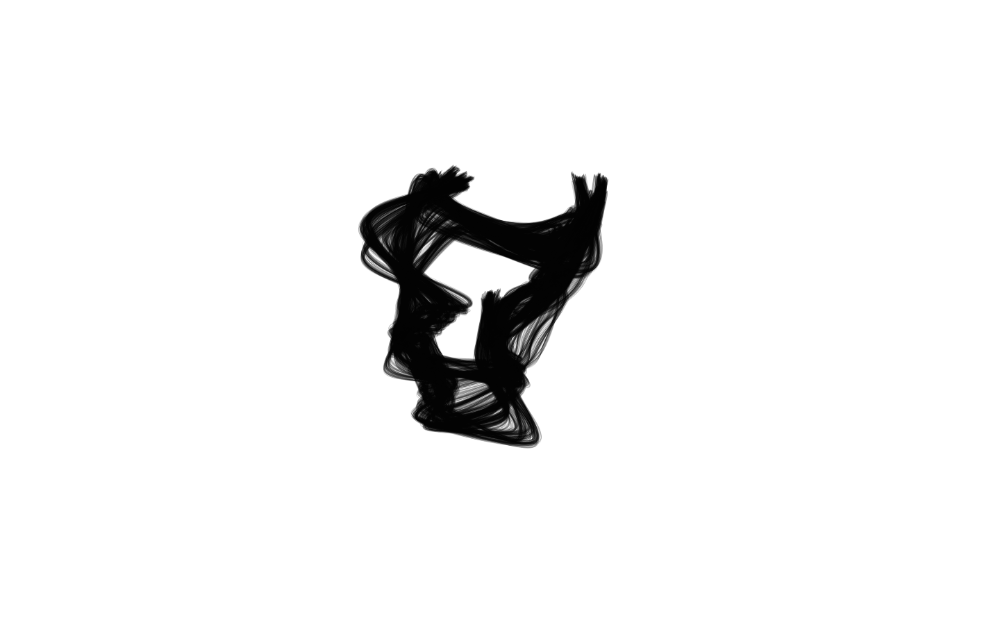

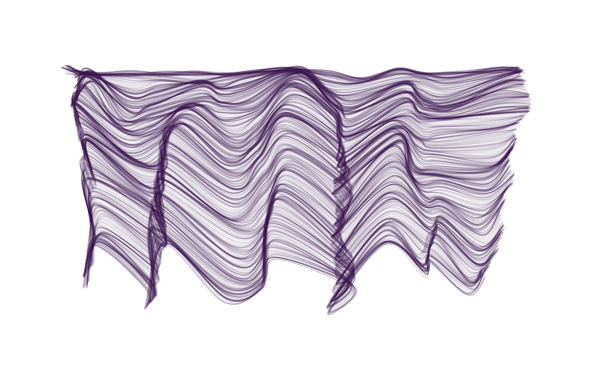

### Growth
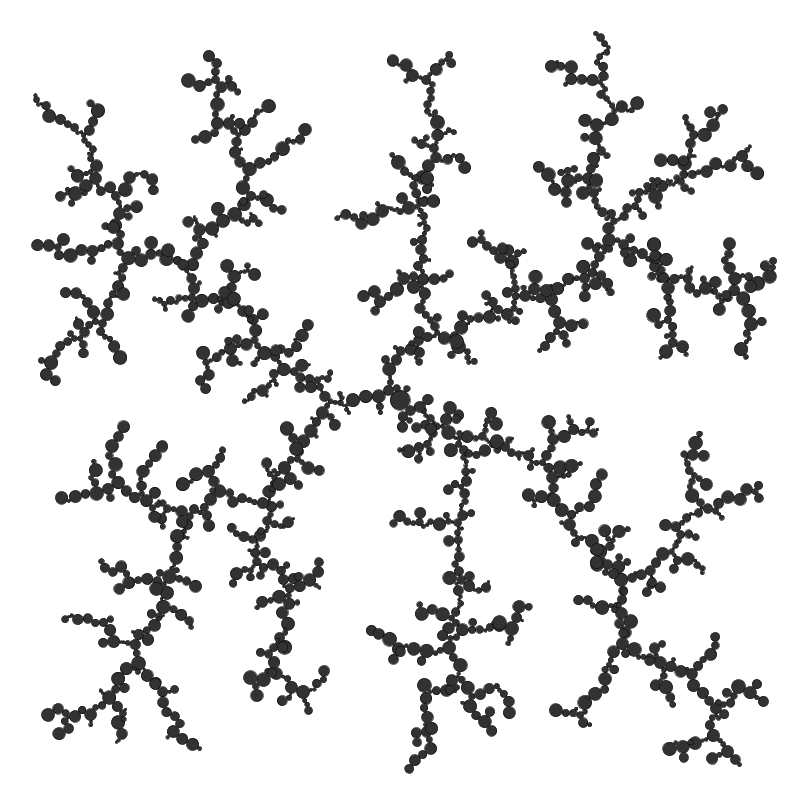
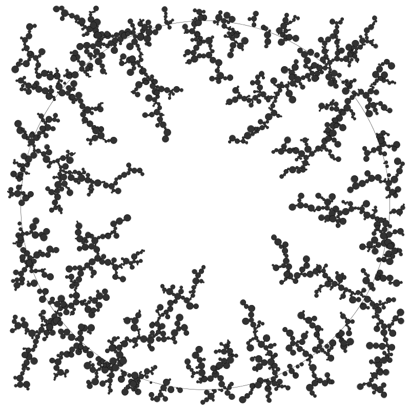
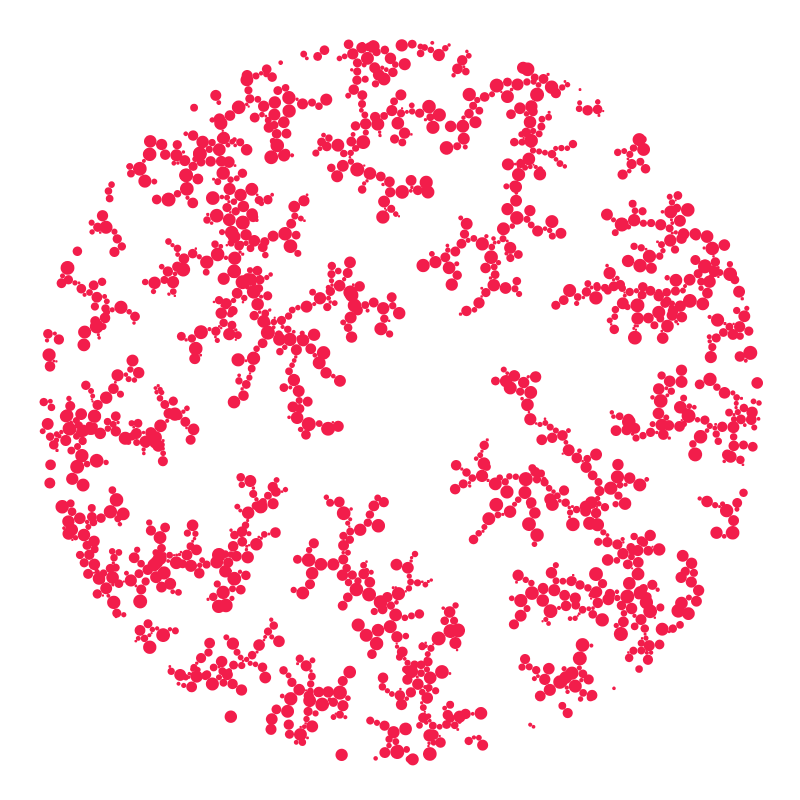

### Circle Pack
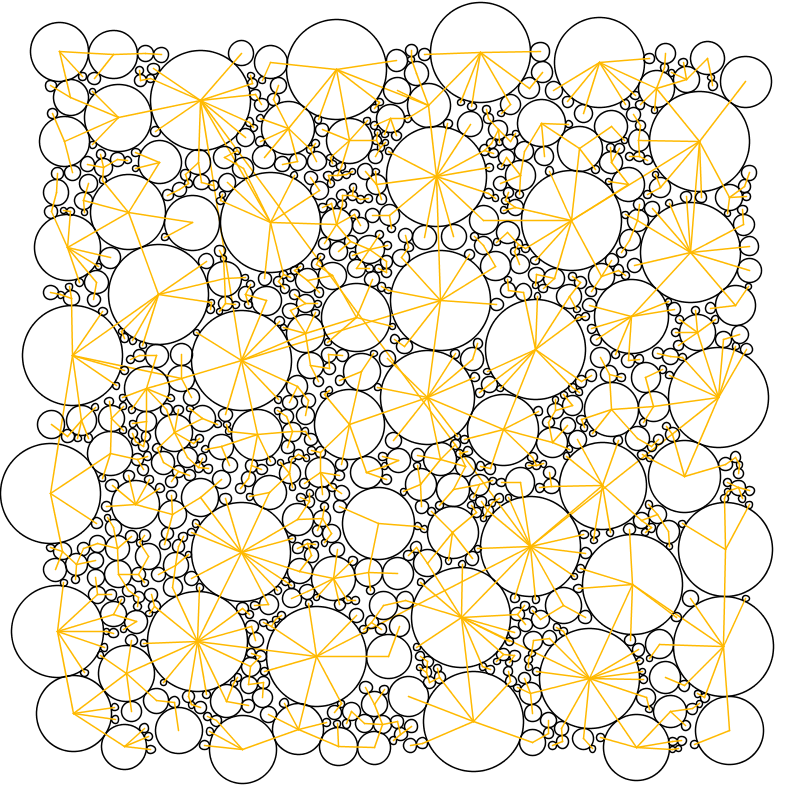
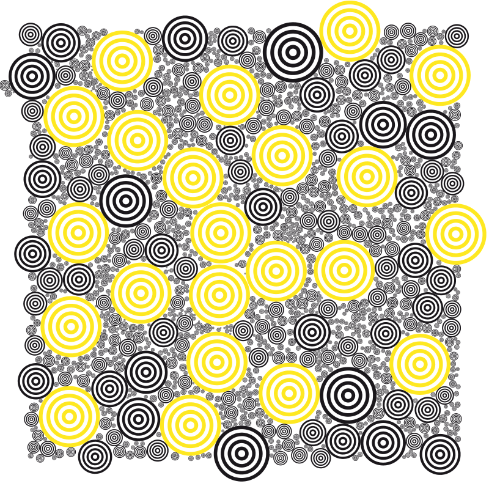

### Animated Brush
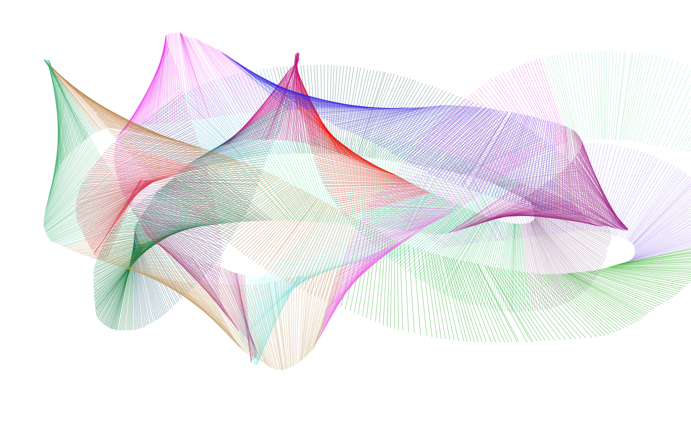

### Text

