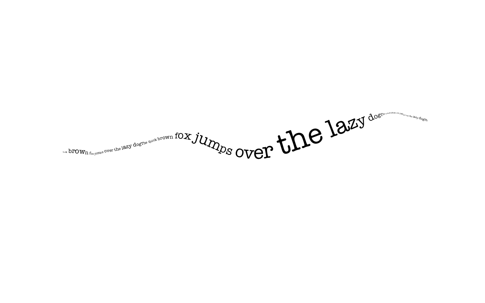

# generativedesign 
#### techniques and portions of code from http://www.generative-gestaltung.de/
#### See all output here: [output dir](src/main/resources/output)
 
## Samples

#### Agents

#### Grid Movement

#### Form Morph

### Growth

### Circle Pack

### Animated Brush

### Text

